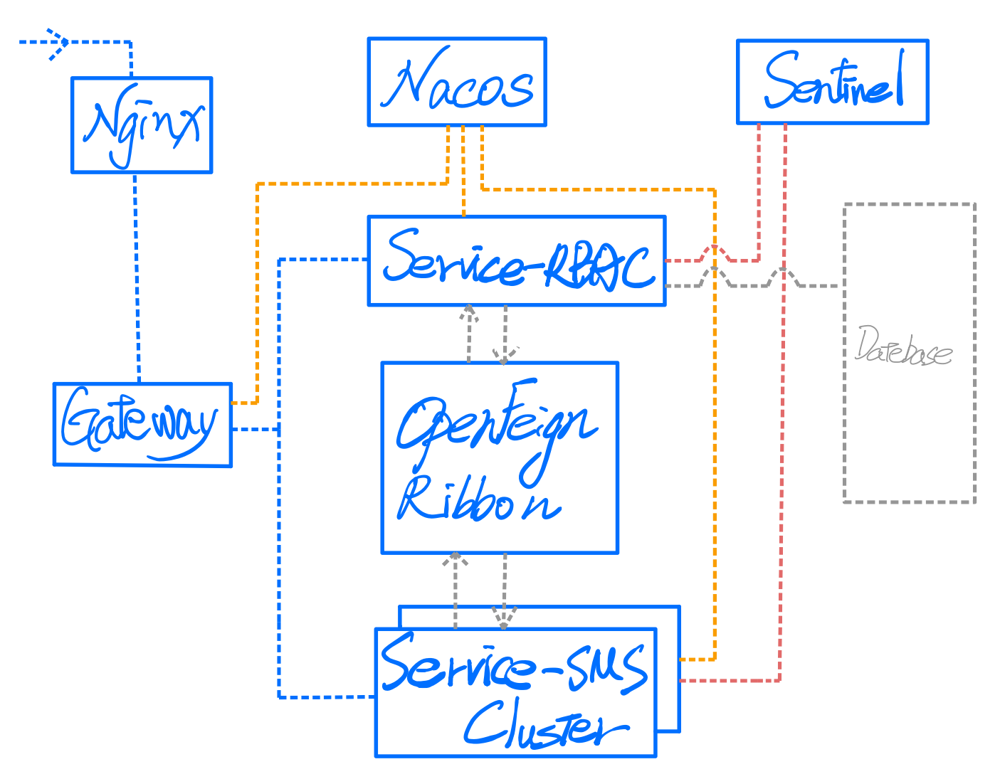
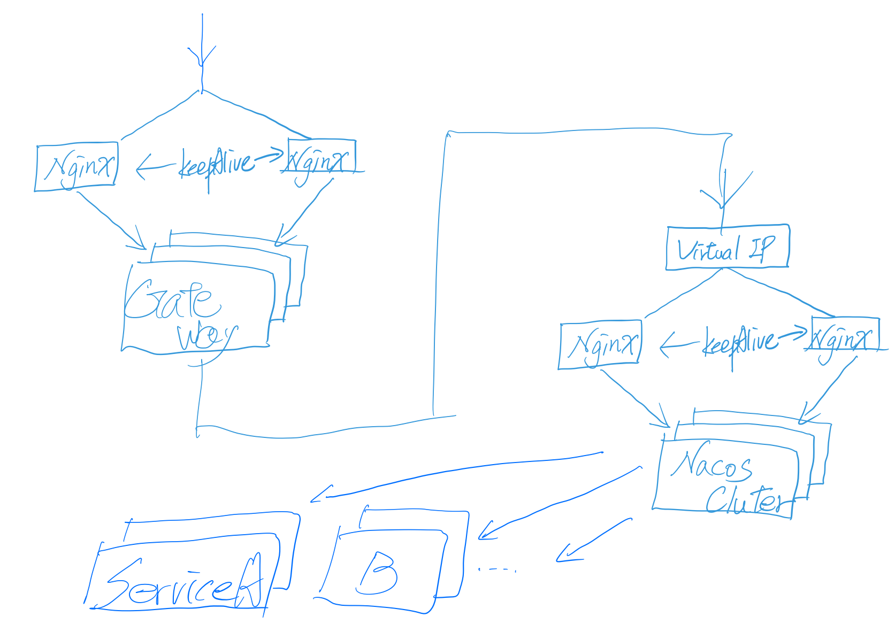

# SpringCloud-Nginx-Nacos-Sentinel-Gateway-BootApps

<br>
<br>

### Structure



<br>
<br>

### Feature

| 組件 | Version |
| :----: | :----: |
| SpringCloud | Hoxton.SR3 |
| SpringBoot | 2.2.5.RELEASE |
| SpringCloud Gateway | 2.2.2.RELEASE |
| SpringCloud Alibab | 2.2.1.RELEASE |
| Nacos | v2.0.4 |
| Sentinel Dashboard | 1.8.0 |
| Nginx| 1.21.6 |

<br>
<br>

### Execute
```
Package Project each Module and put each Folder
```
```
cd Springcloud-Execute
```
```
AllStart.sh
```

<br>
<br>

### Best Further
1. Nacos Cluster with Nginx
1. Gateway Cluster
1. Nginx Cluster with KeepAlive

